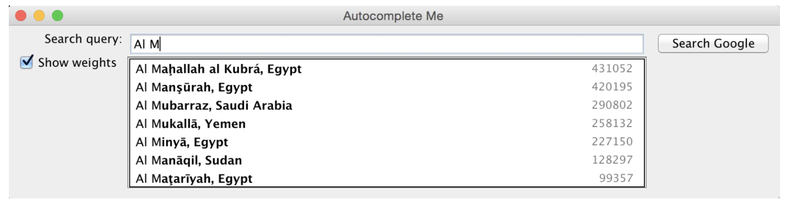

## Autocomplete

### Purpose

This assignment wants us to implement an autocomplete algorithm similar to the ones shown on websites such as IMDB or using the keypad on a phone. 

#### Term

This file consisted of the Term object which implemented a Comparator and Comparable interface. This was arguably one of the most challenging aspects of the assignment but also one of the most interesting. It's neat how you can specify the procedure in which two objects are compared to each other. Each term contains a query string as well as a weight associated with it. Terms can be compared and sorted by entire lexicographic order, lexicographic order of length r, or by weight. Comparing by lexicographic order of length r was quite challenging as well since there were scenarios where one string was longer than the other so I had to take care of all cases. 

#### BinarySearchDeluxe

This file performs a binary search on the data with a specified comparator. There are two methods, one that returns the first index and one that returns the last index of the dataset associated with the key. 

#### Autocomplete

The main file which first sorts the data by lexicographic order, then performs a binary search of a query prefix, and then performs a sort by the weight of the queries and then returns all the results. 

#### AutocompleteGUI

This is a file provided for the assignment to test if the three files function as intended. 

