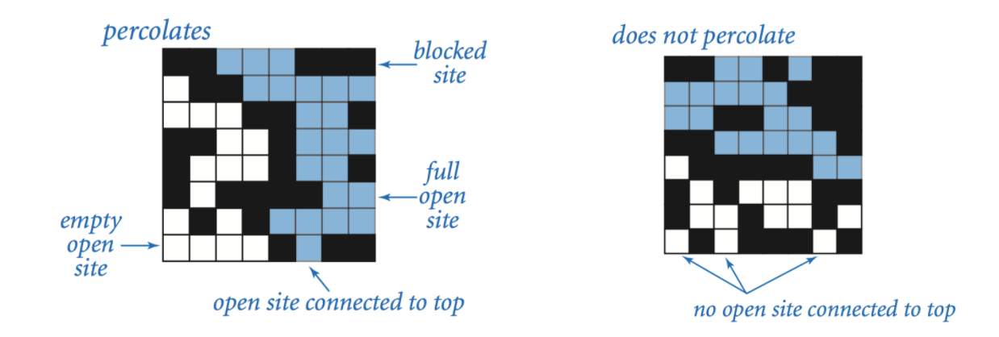

## Percolation

### Purpose

A system percolates when there is an open path from the top site to the bottom site. An example of a system percolating is: 

### Procedure

In a nxn grid, a system percolates with a certain number of sites open. There's no exact mathematical equation that determines the percentage of open sites versus closed sites so this assignment runs a Monte Carlo simulation. 

This assignment asked us to run x simulations on a nxn grid randomly opening up sites until a system percolates. For each simulation, it stores the percentage of open sites against total sites and stores the results. Then the mean, stddev, and 95% confidence interval is returned. 

The algorithm to determine whether a system percolates is done by weighted quick union find. When the simulation is running, a site is randomly chosen to be opened. If the site is closed, its open and then we connect that site to open any other site around it. This simulation constantly runs until the system percolates. 

Percolation contains the algorithm to run a single simulation. PercolationStats runs x simulations and returns the statistics of x simulations. 