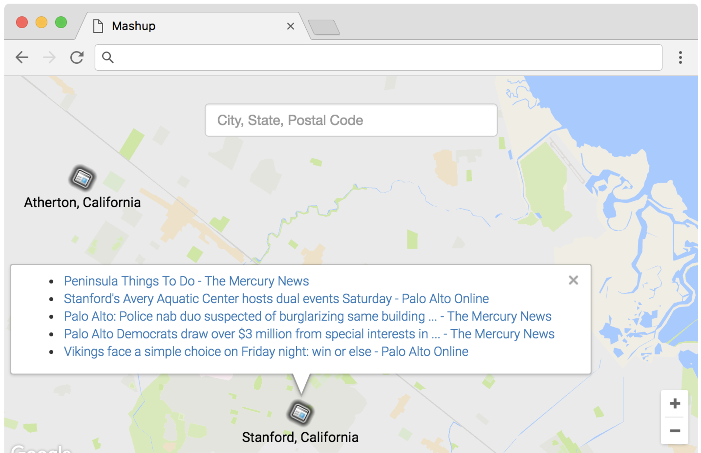

## Mashup

### Purpose

The purpose of the application was to create a website that allows users to search for articles atop of a map location. 

The base file included most of the code for setting up google maps api, grabbing data from google news, and finding 10 locations within the current view of the map. 

### Procedure

This project was really interesting to see how a web application can interact client side javascript with server side python with Flask. I learned more about javascript and the most interesting but challenging aspect was the use of anonymous functions. 

#### Mashup.db

The database stores the locations within the US. I was able to set up the table and import all the data from the txt file. 

#### Application

The specification wanted us to prepare the logic to return 5 articles of a specific location for the marker atop of the map. The search function returns 10 locations for the input to find locations either based off of postal code or city by executing a SQLITE command.

#### Script

The script file contains a lot of the code to initalize the map, update the map based off of a zoom or drag event, show the info of a marker, show the search results that was returned from the application file and configure the map. 

The specification was to include code that added and removed markers at all locations. I used the Maps API to set up markers, such as the location, icon, label name and more. The most difficult challenge was creating a listener for each marker which would display the five search results for that location. 

The last function to implement was to remove all the markers when the map was updated. 