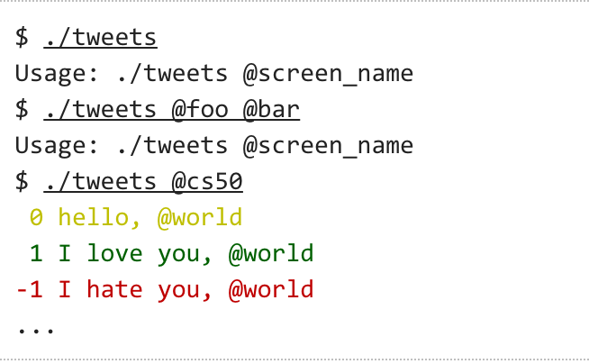
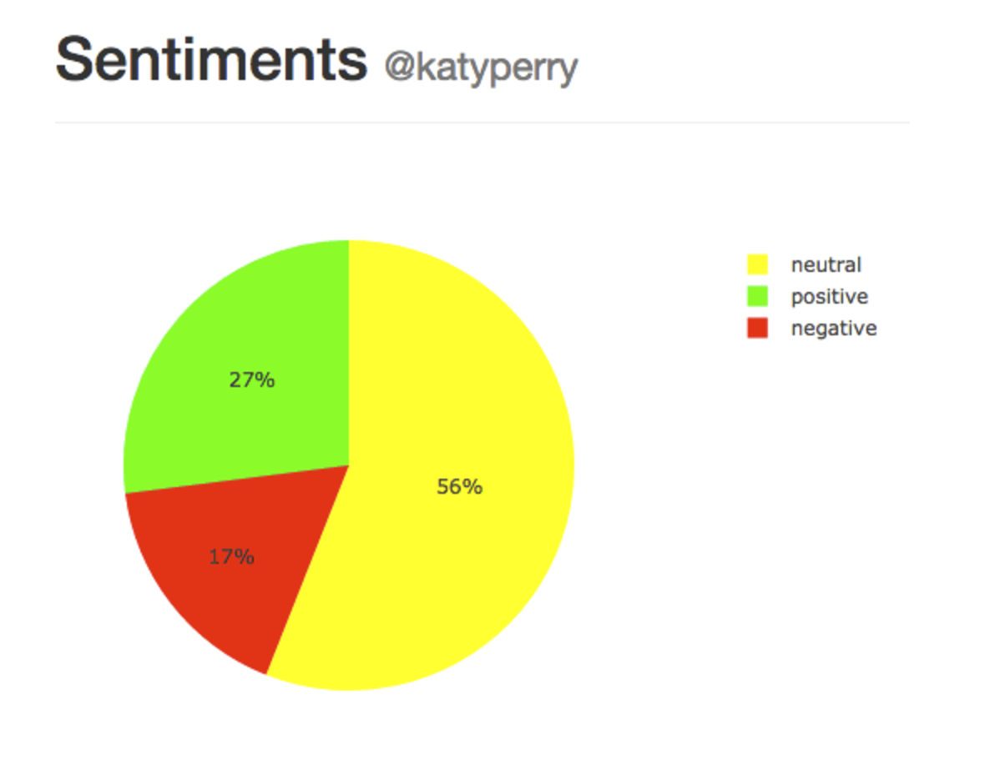

## Problem Set 6

### Purpose

This problem set introduced us to Python and got us to rewrite some program created from C. The main program in this pset was sentiments, a tool to analyze tweets and determine if a tweet was positive or negative. 

### Procedure

The sentiments project was a really interesting introduction to the world of web applications and the Flask microframework. It shows how simple it is to create a full web application and the capabilities of writing simple, beautiful code using Python.

#### Analyzer

The analzyer used the nltk module to tokenize the tweet and then each token is matched against a data set of positive words and negative words. The aggregate sum of words is returned to indicate a positive, negative or neutral tweet. 

#### Tweets 

This file returns 50 most recent tweets and analyzes the sentiment analysis of each tweet. If a tweet is positive, its print to the command line with green color, a negative tweet is printed with red color and a neutral tweet is yellow. 

#### Application

The pset came with the flask application setup but we were tasked with performing the sentiment analysis on 100 tweets for a user and then returning a chart indicated the percentages of positive, negative, and neutral tweets. 

